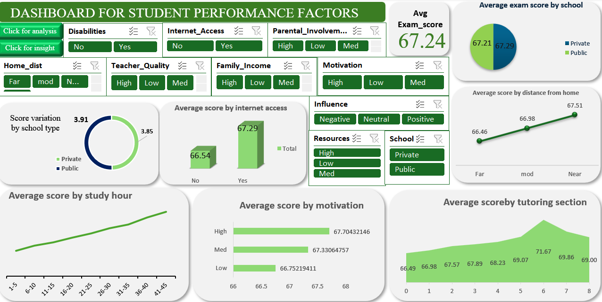

🎓 Student Performance Analysis Dashboard (Excel Project)

📊 Project Overview
This project analyzes student performance data to uncover patterns that affect academic success.  
The goal is to understand how factors such as study time, attendance, and parental involvement influence students’ overall performance.  

All analysis, cleaning, and dashboard creation were done using **Microsoft Excel**.

Objectives
- Clean and organize raw student performance data.  
- Identify trends and relationships between different factors (e.g., gender, study time, absences, scores).  
- Build an interactive **Excel dashboard** for visual analysis and insights.  
- Present data-driven recommendations to improve academic outcomes.

Tools Used
**Microsoft Excel** | Data cleaning, analysis, and dashboard design |
**CSV Dataset** | Original data source |
**Pivot Tables & Charts** | Data summarization and visualization |

Data Cleaning Steps
1. Removed duplicates and missing values.  
2. Standardized column names
3. Converted categorical data (e.g., gender, school) into consistent formats.  
4. Checked for outliers in numeric columns.  
5. Created calculated columns for average scores and performance categories.

📈 Dashboard Features
The dashboard provides quick insights into:
- **Average student scores by gender and subject**
- **Impact of study time on performance**
- **Attendance vs. grades analysis**
- **Top-performing and low-performing students**
- **Interactive slicers for filtering (gender, school, study time)**

Dashboard Preview
Below is a preview of the Excel dashboard:

> *(Open the Excel file in this repository to explore the full interactive dashboard.)*

💡 Key Insights
- Students with **higher study time** tend to perform better on average.  
- **Absences** have a strong negative correlation with final grades.  
- Female students slightly outperform male students in overall scores.  
- **Parental involvement** also showed positive influence on student success.

## 📂 Repository Structure

